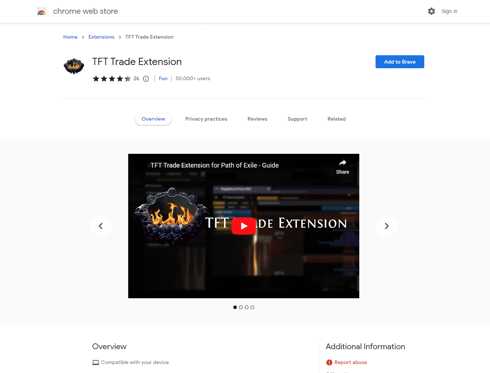
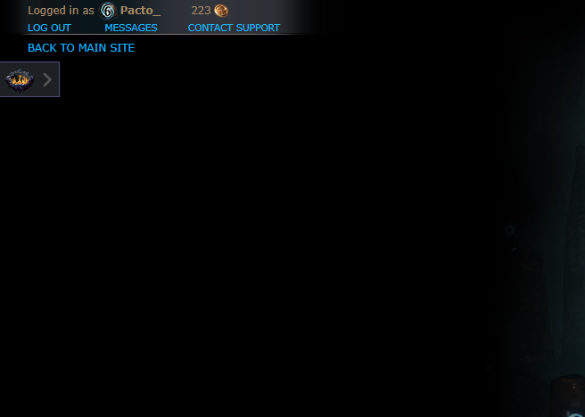
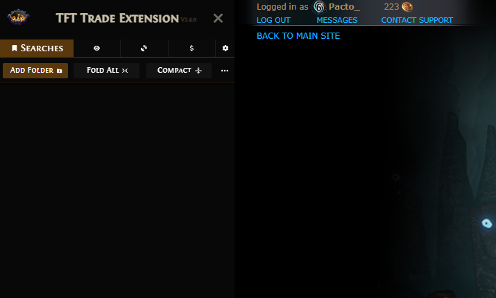
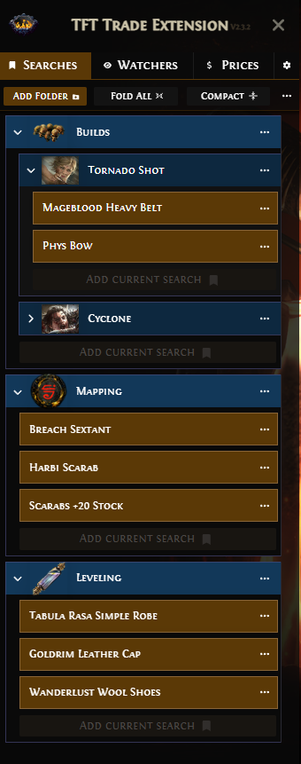
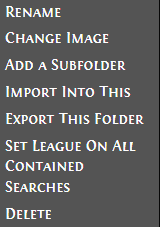
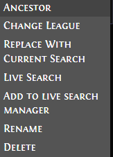
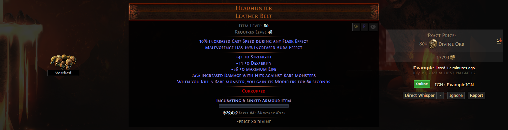
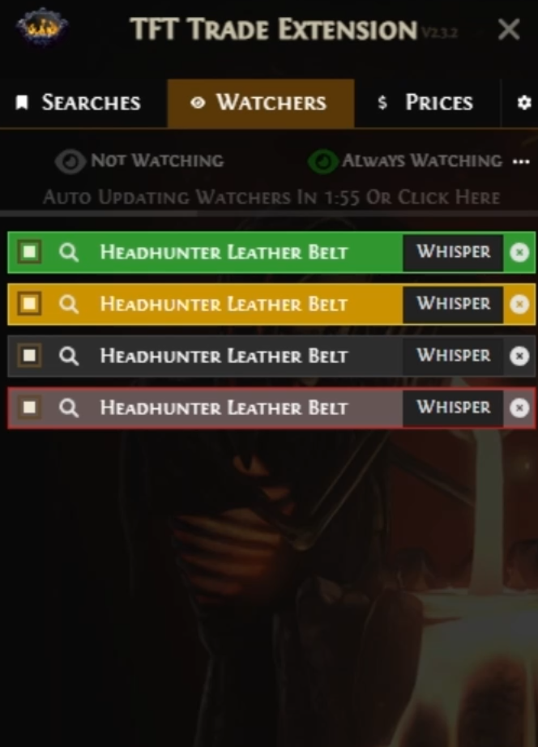
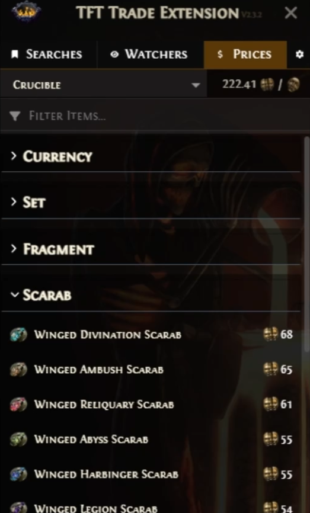

Written guide how to install and use the TFT Trade Extension.

<!--more-->

This extension adds a bunch of functionality to the Path of Exile's trade website. This will be a short guide how to install and use this tool.





## Installation

Depending on your browser go to the extension store and press the "Add to Browser" button
* [firefox](http://firefox.extension.tftrove.com)
* [chrome](http://chrome.extension.tftrove.com)

After that you can head over to the [trade website](https://www.pathofexile.com/trade/search). You can see a a small icon.

## Usage
When you click it a gui will be opened. You will be presented with a couple sections:
* Searches
* Watchers
* Live
* Prices
* Options

### Searches
This section gives you the ability to store bookmarks and organize them in multiple folders.

#### Creating a bookmark
To create a folder you just press the **Add Folder** button. After that you can click **Add Current Search** to save currently opened query to the folder.

#### Bookmark options
Each folder and a search has a dropdow menu. Click the **three dot icon** to reveal it.


* Rename
* Change image - you can change the folder's icon
* Add a subfolder - it creates a nested subfolder
* Import into this - this allows you to import a folder a multiple folders as a nested structure inside this folder
* Export this folder - generates export string which can be shared with friends or treated as a backup
* Set League on All contained searches - sets the league on which contained searches will be opened in
* Delete



* Ancestor - currently selected league for this search
* Change League - change league for this particular search
* Replace With Current Search - overwrite listing with currently opened one
* Live Search - open as live search
* Add to Live Search Manager - adds to [Live Search Manager](#live-search-manager)
* Rename 
* Delete



You can also drag and dop these saved searches and folders and organize your stuff. 
To activate the drag mode just press and hold on either folder header or a search. You can also move searches across folders.


### Watchers

This section allows you to have a list of desired items constantly get updated with their status. 

#### Adding Items to Watchers Menu
You add an item here and whenever the seller comes online/offline/afk or the price changes you will know. You can add an item to this manager by clicking the **eye icon** 

#### Enabling the feature
To enable the this feature you need to press **Not Watching** to start the watcher. You also have the option to toggle **Always Watching** to only watch when the trade website is opened.

You can also unclick the square box next to item's name to stop watching it. You can rename the listing and unfold it.

The items will automatically get updated every couple minutes. You can also click **Click Here** to update the watchers manually.

#### How to read the menu
These listings are color coded
* Green - Seller is *Online*
* Yellow - Seller is *AFK*
* Gray - Seller is *Offline*
* Red - Item is *unavailable*

### Prices

Prices menu fetches the prices from [poe.ninja](https://poe.ninja) and displays them in the extension. You can also check out the Divine to Chaos ratio quickly. 

